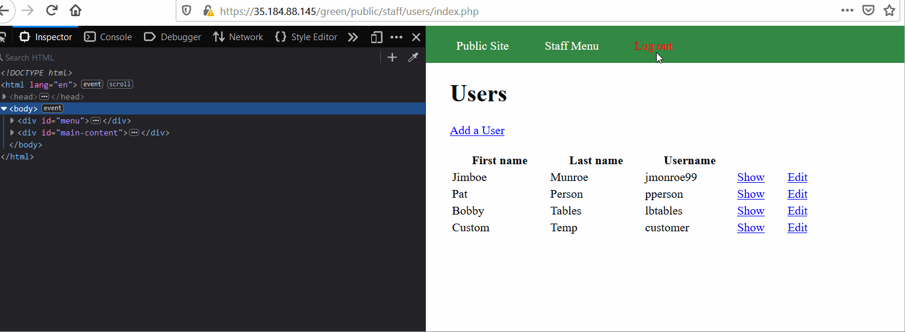

# Project 8 - Pentesting Live Targets

Time spent: **9** hours spent in total

> Objective: Identify vulnerabilities in three different versions of the Globitek website: blue, green, and red.

The six possible exploits are:
* Username Enumeration
* Insecure Direct Object Reference (IDOR)
* SQL Injection (SQLi)
* Cross-Site Scripting (XSS)
* Cross-Site Request Forgery (CSRF)
* Session Hijacking/Fixation

Each version of the site has been given two of the six vulnerabilities. (In other words, all six of the exploits should be assignable to one of the sites.)

## Blue

Vulnerability #1: SQL Injection (SQLi)
The sql query on the salesperson id is not sanitized correctly so it is possible to do a SQL Injection. The result of database query failed when inputting  
```
' OR 1=1; --   
```
demonstrates that it is possible to inject SQL through the url of th salesperson id.


Vulnerability #2: Session Hijacking/Fixation  
By going to "public/hacktools/change_session_id.php" it is possible to change the PHPSessionID in the Attacker browser to be the same PHPSESSID obtained from Burp from intercepting the Victim's traffic. This allows the Attacker to have access to the staff area without logging in.  


## Green

Vulnerability #1: Username Enumeration
It is possible to deduce which usernames are valid by checking the response from a wrong password. Valid usernames are returned in the "failure" span class which bolds text while invalid usernames are returned in the "failed" span tag.


Vulnerability #2: Cross-Site Scripting (XSS)
The contact form does not check for XSS so an admin viewing Feedback is subject to XSS attacks.


## Red

Vulnerability #1: Insecure Direct Object Reference (IDOR)  
When not logged in, it is possible to see salespersons that should not be accessible to non sales members. This is possible by changind the id of the requested page to 10 which should not be public.  


Vulnerability #2: Cross-Site Request Forgery (CSRF)
An authenticated user is able to submit an update form or other POST request without a valid CSRF token, demonstrating improper token validation.


## Notes

I wanted to find an SQLi that actually returned results from the database, but being unable to settled for showing that it is possible to do SQLi through the failed databse query error. The difference between the vaid and invalid results would have been tough to notice if it weren't for the fact that valid usernames return a bolded failure notice. I had to go an create a new user in order to demonstrate this attack as the recommended user had too many sign on attempts already and returned the 4 minute timeout instead.

